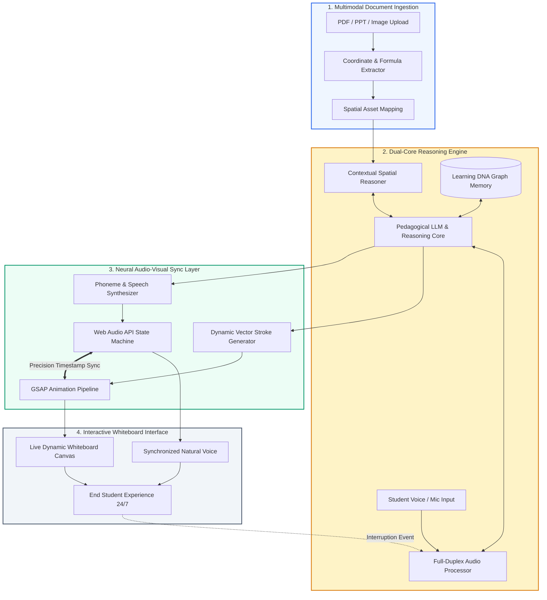

<div align="center">

# 🧠 ILMORA (`ilmorahq`)
### **The First Real-Time AI Voice & Visual Tutor Engine**
*An AI EdTech innovation that adapts to students, not the other way around.*

[](https://ilmora.co.id)
[](https://ilmora.co.id)
[](https://ui.ac.id)
[](https://ilmora.co.id)

<br/>

```
  ___ _       __  __  ___  ____    _   
 |_ _| |     |  \/  |/ _ \|  _ \  / \  
  | || |     | |\/| | | | | |_) |/ _ \ 
  | || |___  | |  | | |_| |  _ </ ___ \
 |___|_____| |_|  |_|\___/|_| \_\_/   \_\
   Real-Time Voice • Neural Whiteboard • Learning DNA
```

<p align="center">
  <b>Democratizing elite 1-on-1 private tutoring with multimodal spatial intelligence at &lt;10% of traditional tutoring costs.</b>
</p>

---

[🌐 Live Platform](https://ilmora.co.id) • [📖 Core Technology](#-core-technology-pillars) • [🏗️ Architecture](#️-system-architecture) • [🚀 PaaS API](#-ilmora-for-developers--partners-paas) • [🔬 Research & Awards](#-research--academic-foundation) • [📬 Contact](#-get-in-touch)

---

</div>

<br/>

## 🌟 Executive Summary

**Ilmora** ([PT Ilmora Digital Innovation](https://ilmora.co.id), originating from Universitas Indonesia) is the next-generation AI EdTech platform powered by a **Dual-Core Visual & Voice Reasoning Engine**. 

Over **60% of parents seek personalized private tutoring**, but conventional 1-on-1 human tutors are cost-prohibitive ($150–$300/month or $8–$30/hour), while existing digital EdTech platforms rely on passive, boring one-way videos with **0% live adaptability**. Meanwhile, general Large Language Models (LLMs) are text-bound, pedagogically blind, and spatial-agnostic.

**Ilmora bridges this divide**: an autonomous, interruptible, real-time AI tutor that can listen, speak, sketch formulas, dissect documents (PDF/PPT), animate complex scientific concepts on an infinite whiteboard, and build a persistent **Learning DNA** for every student—available **24/7 at $20/month**.

---

## ⚡ The Moat: Why Ilmora Wins

| Dimension | 👨‍🏫 Conventional Private Tutor | 📺 Traditional EdTech (Video / Static) | 🤖 Generic LLMs (ChatGPT / Claude) | 🚀 **ILMORA (Our Engine)** |
| :--- | :--- | :--- | :--- | :--- |
| **Real-Time Voice** | Highly interactive, but exhausting | ❌ 0% interaction (Pre-recorded) | ⚠️ Speech-to-text wrapper, slow latency | **✅ 100% Real-time, interruptible mid-stream** |
| **Visual Reasoning** | Physical whiteboard / notebook | ❌ Static diagrams or fixed video cuts | ❌ Blind to spatial canvas & geometry | **✅ Dynamic Whiteboard with Virtual Coordinate System** |
| **Audio-Visual Sync** | Natural human speech & gesture | ❌ Rigid animations | ❌ None | **✅ Neural Whiteboard Sync (GSAP + Web Audio API)** |
| **Pedagogical Memory** | Dependent on tutor notes/memory | ❌ One-size-fits-all curriculum | ⚠️ Ephemeral context window | **✅ Learning DNA: tracks cognitive style across sessions** |
| **Accessibility & Cost** | $150 – $300 / mo ($8 – $30 / hr) | $5 – $15 / mo (high drop-off rates) | $20 / mo (not built for pedagogy) | **💎 $20 / mo for 24/7 personalized multimodal tutoring** |

---

## 🔬 Core Technology Pillars

### 1. 🎙️ 100% Interruptible Real-Time Voice Interaction
Unlike conventional chatbots or robotic voice assistants, Ilmora's conversational pipeline supports **full duplex audio streaming**. Students do not wait for the AI to finish a 3-minute lecture; they can interrupt naturally mid-sentence (*"Wait, why did you square that variable?"*), and Ilmora pauses its whiteboard drawing instantly, re-evaluates the query, and clarifies doubts intuitively.

### 2. 🎨 Smart Digital Whiteboard (Next-Gen Visual Engine)
- **Multi-Format Material Ingestion**: Instantly parses PDFs, PowerPoint presentations, and handwritten problem sheets.
- **Formula & Asset Extraction**: Isolates mathematical equations, physics diagrams, and coordinate planes into vector components with visual cropping and automatic bounding coordinates.
- **Infinite Canvas Workspace**: Interactive whiteboard where the AI draws geometric figures, plots curves, and solves equations step-by-step.

### 3. 📐 Contextual Spatial Reasoning (Virtual Coordinate System)
Ilmora maps all canvas assets into a global **Virtual Coordinate Space**. The AI tutor possesses precise spatial awareness of where each term, diagram, and note resides:
- Audio narration directly references spatial visual items (*"Look at this datapath component on the bottom left"*).
- Visual laser pointers, contextual highlighters, and dynamic callouts guide student attention precisely when spoken.

### 4. ⚡ Neural Whiteboard Sync (GSAP & Web Audio API)
Audio and visuals are orchestrated through microsecond-precision synchronization:
- Integrates **GSAP (GreenSock Animation Platform)** with the **Web Audio API** state machine.
- Generates dynamic SVG vector strokes, path highlights, and handwritten strokes perfectly synchronized with phoneme intervals in the AI's synthetic speech.

### 5. 🧬 Progressive Learning Memory ("Learning DNA")
Every student possesses a unique cognitive fingerprint. Ilmora's **Learning DNA** subsystem continuously tracks:
- Confusion triggers, pause frequency, and cognitive hesitation points.
- Questioning depth and conversational interruptions.
- Problem-solving speed across different scientific domains.
- Automatically synthesizes these insights to tailor the curriculum and pacing dynamically from session to session.

---

## 🏗️ System Architecture



---

## 💼 Ilmora for Developers & Partners (PaaS)

Ilmora is not only a B2C application—it operates as a robust **Platform-as-a-Service (PaaS)** for the global AI and EdTech ecosystem:

```
[ EdTech Startups & Enterprises ]
              │
              ▼  (REST & WebSocket API)
   ┌───────────────────────────────────────────────┐
   │       ILMORA VISUAL REASONING ENGINE API      │
   │  ├─ Document Spatial Ingestion API            │
   │  ├─ Real-Time Whiteboard Stroke Streamer      │
   │  ├─ Duplex Voice & Audio Synchronization      │
   │  └─ Learning DNA State Graph Engine           │
   └───────────────────────────────────────────────┘
```

- **Avoid Re-inventing the Wheel**: Saves institutions and EdTech companies millions in R&D required to build low-latency spatial visual reasoning engines from scratch.
- **Enterprise-Ready Licensing**: Flexible hybrid monetization featuring pay-per-token API consumption alongside dedicated enterprise licensing.
- **Projected Target**: Enabling 5,000+ partners to serve over 1.2 Billion visual-voice queries.

---

## 🔬 Research & Academic Foundation

Ilmora is rooted in rigorous academic research from **Universitas Indonesia**, led by **Adriana Ainurrahmah Damanik**, focusing on inclusive educational technologies and AI accessibility:

### Published Research & Inventions
- **EDLIG (*Education Disability Learning Inclusive Game*)**:
  *Effectiveness of education-based game application as learning media for teachers of hearing disability students as an effort to improve communication in the learning process.*
- **BEFU (*Better Future*)**:
  *Mobile climate change integration platform featuring vehicular carbon detection and educational modules advancing environmental awareness in alignment with UN SDG-13.*

### Honors & Recognitions
- 🥇 **Gold Medal** — *Jakarta International Science Fair (JISF)*
- 🥇 **Gold Medal** — *World Innovation Competition and Exhibition (WICE)*
- 🏆 **1st Place & Best Presenter** — *Universitas Indonesia Science Olympiad*

---

## 🛠️ Technology Stack

<div align="center">

| Layer | Technologies & Frameworks |
| :--- | :--- |
| **Frontend & Canvas** | TypeScript • React / Next.js • Canvas API • GSAP (GreenSock) • Tailwind CSS |
| **Real-Time Audio** | Web Audio API • WebRTC • Duplex WebSocket streaming • Low-latency STT/TTS |
| **Visual & Spatial AI** | Spatial Coordinate Engine • LaTeX/Formula OCR • LayoutLM • OpenCV • Vector Parsing |
| **Reasoning Core** | Multimodal LLMs • Contextual Spatial Reasoning • Pedagogical Memory Graph |
| **Infrastructure** | Cloud-native microservices • Docker • Redis Cache • Edge Delivery |

</div>

---

## 🗺️ Open Ecosystem Roadmap

- [x] **Core Prototype**: Infinite whiteboard engine with real-time visual reasoning and speech alignment.
- [x] **Live B2C Platform**: Deployed and accessible at [ilmora.co.id](https://ilmora.co.id).
- [ ] **Ilmora SDK (`@ilmora/whiteboard-sdk`)**: Open-source headless canvas bindings for React & Web components.
- [ ] **Learning DNA Standard**: Open cognitive data schema specification for adaptive learning trajectories.
- [ ] **Developer PaaS API Gateway**: Public developer portal with documentation, sample notebooks, and API keys.

---

## 📬 Get in Touch

We collaborate with academic researchers, school districts, EdTech builders, and AI practitioners.

- 🌐 **Platform**: [ilmora.co.id](https://ilmora.co.id)
- 🏢 **Company**: PT Ilmora Digital Innovation
- 🎓 **Academic Base**: Universitas Indonesia
- ✉️ **Direct Inquiries**: [adriana.ainurrahmah@gmail.com](mailto:adriana.ainurrahmah@gmail.com)
- 💼 **GitHub**: [@ilmorahq](https://github.com/ilmorahq)

<br/>

<div align="center">
  <sub>© PT Ilmora Digital Innovation • Universitas Indonesia. Shaping the future of education through adaptive intelligence.</sub>
</div>
